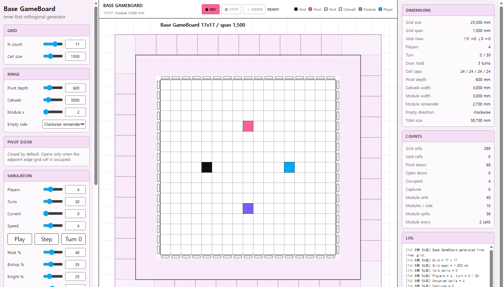
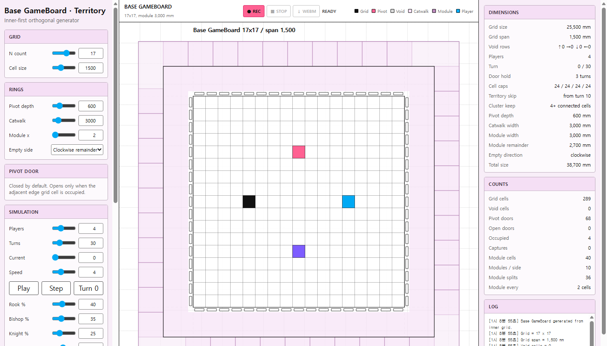
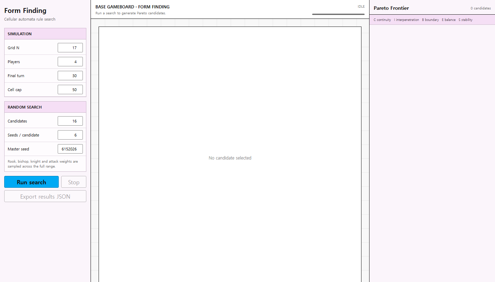
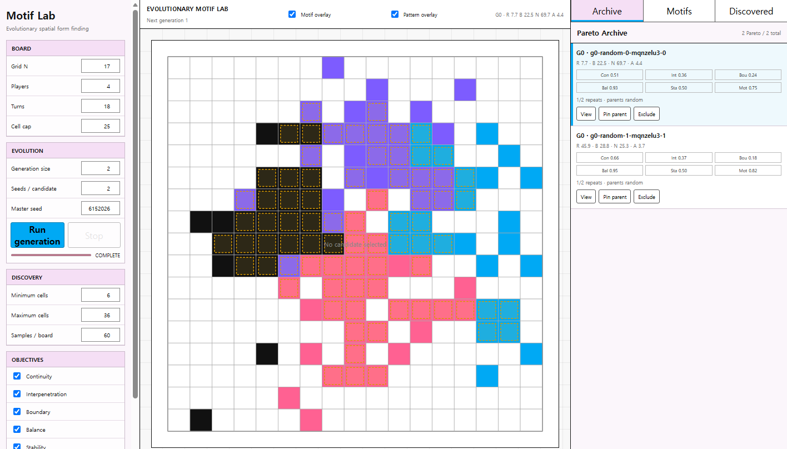
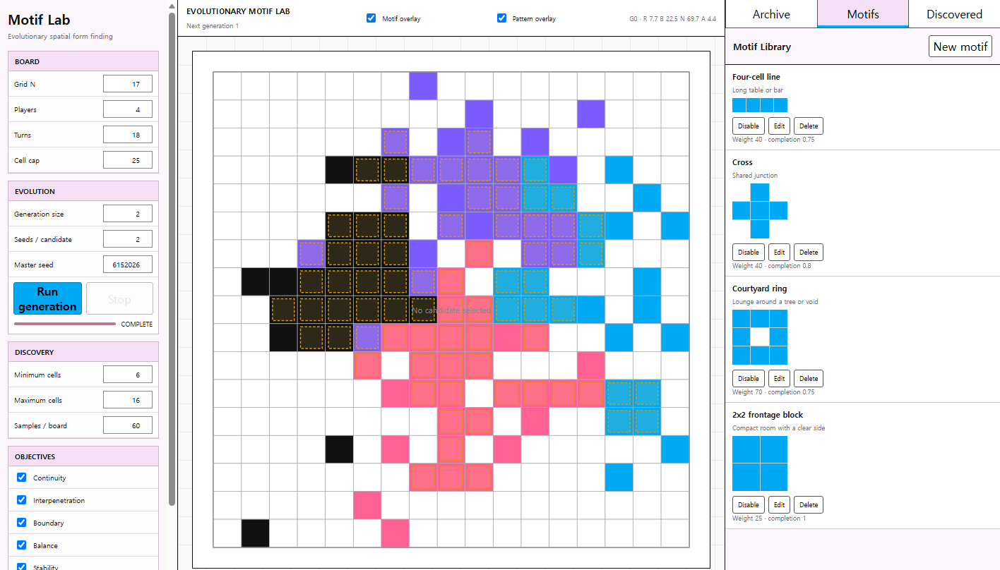
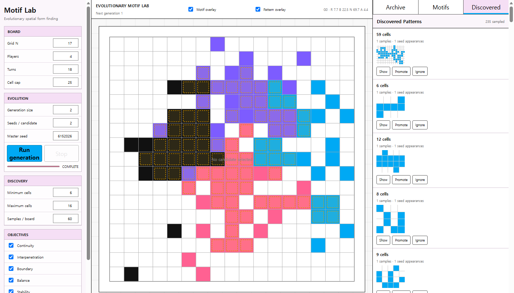
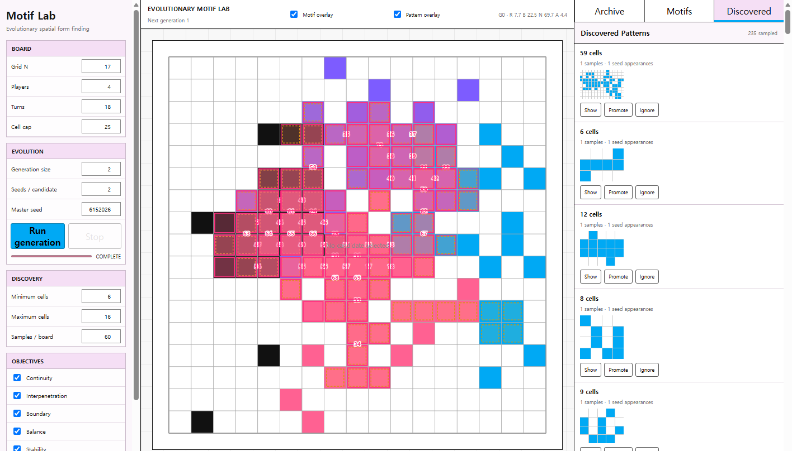

# Patch Notes Through 5177

Generated: 2026-06-22

This document summarizes the local app versions created so far and records the current QA status for the active `5177` Motif Lab.

## Links

- Base GameBoard: `http://127.0.0.1:5174/`
- Territory Variant: `http://127.0.0.1:5175/`
- Form Finding Phase 1: `http://127.0.0.1:5176/`
- Evolutionary Motif Lab: `http://127.0.0.1:5177/`

## Chronological Screenshot Index

Use this section when reviewing the project from the beginning.

1. `5174` Base GameBoard  
   

2. `5175` Territory Variant  
   

3. `5176` Form Finding Phase 1  
   

4. `5177` Evolutionary Motif Lab  
   

## Patch 01: Base GameBoard Web Port

Summary:

- Converted the Grasshopper/Python gameboard generator concept into a browser app.
- Implemented orthogonal N-by-N grid, void-side deletion, catwalk/module visualization, pivot-door plan representation, and player occupation simulation.
- Preserved the simplified gameboard as the base local version.

Main files:

- `base-gameboard/index.html`
- `base-gameboard/style.css`
- `base-gameboard/app.js`
- `base-gameboard/server.mjs`

Tests:

- Later recording tests remain available in `base-gameboard/recording.test.mjs`.

Browser QA:

- Current patch-note pass confirmed `http://127.0.0.1:5174/` returned `200`.
- Browser QA confirmed title `Base GameBoard` and board surface present.
- Representative screenshot: `screenshots/5174-01-base-gameboard.png`.

Remaining risk:

- Base version is preserved for reference, not the recommended target for new pattern-engine work.

## Patch 02: Palette and Recording

Summary:

- Changed the board visual style toward the supplied reference palette.
- Added board-only WebM recording with compact settings metadata.
- Defaulted grid count to `17` and module multiplier to `2`.
- Tuned line weight and visual contrast for recording output.

Main files:

- `base-gameboard/recording.js`
- `base-gameboard/recording.test.mjs`
- `base-gameboard/index.html`
- `base-gameboard/style.css`
- `base-gameboard/app.js`

Tests:

- Recording tests are included in the current full motif-lab test run through copied modules.

Browser QA:

- Earlier in-app recording crash was fixed by preferring VP8 WebM.
- Visual style is represented in the `5174` screenshot because this patch landed before later copies were made.

Remaining risk:

- WebM playback depends on the user's chosen video player/browser support.

## Patch 03: Territory Variant

Summary:

- Created a preserved copy for territory behavior.
- Added territory-skip logic to reduce over-concentrated expansion.
- Generalized cluster retention from fixed 2x2 blocks to adjustable connected-group size.

Main files:

- `base-gameboard-territory/territory.js`
- `base-gameboard-territory/territory.test.mjs`
- copied app shell from `base-gameboard`

Tests:

- Territory tests are included in current full copied-module verification.

Browser QA:

- Current patch-note pass confirmed `http://127.0.0.1:5175/` returned `200`.
- Browser QA confirmed title `Base GameBoard · Territory` and board surface present.
- Representative screenshot: `screenshots/5175-01-territory-variant.png`.

Remaining risk:

- Territory skip is useful for simulation behavior exploration but is not part of the upcoming pattern-engine reset unless explicitly reintroduced.

## Patch 04: Form Finding Phase 1

Summary:

- Created separate `5176` form-finding app.
- Shifted evaluation from game-winning behavior to final-state spatial metrics.
- Added random search, seeded repeat evaluation, Pareto frontier, canonical final-pattern comparison, and objective display.

Main files:

- `base-gameboard-form-finding/form-metrics.js`
- `base-gameboard-form-finding/form-search.js`
- `base-gameboard-form-finding/form-simulation.js`
- `base-gameboard-form-finding/form-app.js`
- related `*.test.mjs`

Tests:

- Metric/search/simulation tests are retained and copied into `5177`.

Browser QA:

- Current patch-note pass confirmed `http://127.0.0.1:5176/` returned `200`.
- Browser QA confirmed title `Base GameBoard · Form Finding` and board surface present.
- Representative screenshot: `screenshots/5176-01-form-finding.png`.

Remaining risk:

- Metrics are useful but may later be replaced by motif/furniture-driven architectural fitness.

## Patch 05: Evolutionary Motif Lab

Summary:

- Created active `5177` app.
- Added multi-generation evolutionary search with archive, Pareto candidates, parent pinning, exclusion, crossover, mutation, and candidate lineage.
- Added motif library, discovered pattern list, motif editor, localStorage persistence, JSON export/import/reset, and dynamic objective toggles.

Main files:

- `base-gameboard-motif-lab/index.html`
- `base-gameboard-motif-lab/style.css`
- `base-gameboard-motif-lab/lab-app.js`
- `base-gameboard-motif-lab/motif-engine.js`
- `base-gameboard-motif-lab/evolution.js`
- `base-gameboard-motif-lab/storage.js`
- `base-gameboard-motif-lab/server.mjs`
- related `*.test.mjs`

Tests:

- Current full verification: `43/43` Node tests passed.

Browser QA:

- Current HTTP check: `http://127.0.0.1:5177/` returned `200`.
- Current automated browser QA JSON:
  - title: `Evolutionary Motif Lab`
  - archive: `2 Pareto / 2 total`
  - discovered: `235 sampled`
  - board rendered: `true`
  - motif overlay rendered: `true`
  - discovered pattern overlay rendered after Show: `true`

Remaining risk:

- The current motif editor and discovery model are being superseded by the next pattern-engine reset.
- Stored localStorage data can differ per browser profile.

## Patch 06: 5177 Pattern Overlay Improvements

Summary:

- Added selected discovered-pattern overlay through `Discovered -> Show`.
- Added always-on motif overlay for enabled Motif Library motifs.
- Used different colors for the two overlay types:
  - motif overlay: amber dashed overlay
  - selected discovered overlay: pink overlay
- Added pure matching helpers for discovered pattern occurrences and selected motif occurrences.

Main files:

- `base-gameboard-motif-lab/index.html`
- `base-gameboard-motif-lab/lab-app.js`
- `base-gameboard-motif-lab/motif-engine.js`
- `base-gameboard-motif-lab/motif-engine.test.mjs`
- `base-gameboard-motif-lab/overlay.css`

Tests:

- Added tests:
  - discovered pattern occurrence matching
  - enabled motif occurrence selection
- Current full verification: `43/43` Node tests passed.

Browser QA:

- Current screenshots generated from `5177` with a short temporary generation run.
- Motif and discovered overlays both verified in browser QA JSON.

Remaining risk:

- Discovered `Show` overlay only appears when the selected discovered pattern occurs on the currently selected representative board.
- The next `5178` pattern-engine work may replace this overlay data path.

## Patch 07: Next-Session Pattern Engine Handoff

Summary:

- Wrote the next-session handoff for moving to a preserved-copy `5178` pattern-engine reset.
- Captured the planned workflow for ChatGPT, Codex, and Claude Code collaboration.
- Decided to preserve `5177` and create a new `base-gameboard-pattern-engine` app on port `5178`.

Main files:

- `docs/next-session-pattern-engine-handoff.md`
- `docs/gpt-handoff-current-work.md`

Tests:

- Documentation-only patch; no runtime tests required.

Browser QA:

- Not applicable.

Remaining risk:

- The next session must still inspect live code before implementing the `5178` copy.
- Claude Code tasks should be scoped to one module at a time to avoid file conflicts.

## 5177 Representative Screenshots

Screenshots are stored in:

- `docs/patch-notes/screenshots/`

Files:

- `5177-01-evolution-archive.png`
- `5174-01-base-gameboard.png`
- `5175-01-territory-variant.png`
- `5176-01-form-finding.png`
- `5177-02-motif-library-overlay.png`
- `5177-03-discovered-patterns.png`
- `5177-04-discovered-show-overlay.png`

Preview:








## Fresh Verification Commands

Commands run on 2026-06-22:

```powershell
Invoke-WebRequest -Uri 'http://127.0.0.1:5174/' -UseBasicParsing
Invoke-WebRequest -Uri 'http://127.0.0.1:5175/' -UseBasicParsing
Invoke-WebRequest -Uri 'http://127.0.0.1:5176/' -UseBasicParsing
Invoke-WebRequest -Uri 'http://127.0.0.1:5177/' -UseBasicParsing
```

Result:

```text
5174 StatusCode 200
5175 StatusCode 200
5176 StatusCode 200
5177 StatusCode 200
```

```powershell
$node='C:\Users\User\.cache\codex-runtimes\codex-primary-runtime\dependencies\node\bin\node.exe'
& $node --test 'base-gameboard-motif-lab\*.test.mjs'
```

Result:

```text
tests 43
pass 43
fail 0
```

```powershell
$node='C:\Users\User\.cache\codex-runtimes\codex-primary-runtime\dependencies\node\bin\node.exe'
Get-ChildItem 'base-gameboard-motif-lab' -Filter '*.js' | ForEach-Object { & $node --check $_.FullName }
```

Result:

```text
exit code 0
```

```powershell
Invoke-WebRequest -Uri 'http://127.0.0.1:5177/' -UseBasicParsing
```

Result:

```text
StatusCode 200
```

## Browser QA Notes

- In-app browser loaded `5177` successfully and reported no console errors or warnings during the initial check.
- In-app screenshot capture timed out at CDP `Page.captureScreenshot`.
- Representative screenshots were generated with Microsoft Edge headless through Chrome DevTools Protocol.
- Screenshot generation used a temporary browser profile and a short temporary generation run, so it does not depend on the user's in-app localStorage.

## Current Recommendation

Do not continue large pattern-engine changes in `5177`.

Next implementation should:

```text
copy base-gameboard-motif-lab
  -> base-gameboard-pattern-engine
  -> port 5178
  -> replace discovery/motif internals there
```
